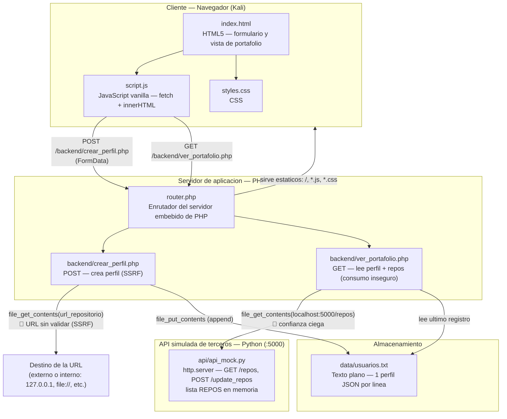

# Arquitectura de Componentes de Software

Proyecto de Ciberseguridad UCAB 2026 — aplicacion **"Portafolio Dev"** (rama
`versión-vulnerable`).

Este documento describe los **componentes de software** de la aplicacion, sus
tecnologias y como se comunican entre si. Es distinto del diagrama de **red**
(VMs Kali/Ubuntu) que ya esta en [despliegue_vms.md](despliegue_vms.md) §1: aqui
no se modelan las maquinas, sino las piezas de codigo y su flujo de datos.

## Diagrama de componentes

## Capas y tecnologias

| Capa | Componente | Tecnologia | Puerto | Responsabilidad |
|---|---|---|---|---|
| Cliente | `frontend/index.html` | HTML5 | — | Formulario de perfil y contenedores del portafolio |
| Cliente | `frontend/script.js` | JavaScript vanilla (`fetch`, `innerHTML`) | — | Envia el formulario, pide el portafolio y **renderiza la respuesta en el DOM** |
| Cliente | `frontend/styles.css` | CSS | — | Estilos |
| Servidor | `router.php` | PHP 8 (servidor embebido `php -S`) | 8080 | Enruta: sirve estaticos del frontend y despacha `/backend/*.php` |
| Servidor | `backend/crear_perfil.php` | PHP 8 | 8080 | Recibe el POST, hace la peticion saliente y persiste el perfil |
| Servidor | `backend/ver_portafolio.php` | PHP 8 | 8080 | Lee el ultimo perfil y consulta la API mock; devuelve todo en un JSON |
| Almacenamiento | `data/usuarios.txt` | Texto plano (una linea JSON por perfil) | — | Persistencia de perfiles (sin base de datos) |
| API de terceros | `api/api_mock.py` | Python 3 (`http.server`) | 5000 | Simula una API externa de repositorios; expone `/repos` y `/update_repos` |

## Comunicacion entre componentes

1. **Navegador → Servidor PHP (mismo origen).** `script.js` usa
   `const API_BASE = window.location.origin` (ver [despliegue_vms.md](despliegue_vms.md)
   §8, fila del `API_BASE`), de modo que los `fetch` apuntan siempre al host desde
   el que se cargo la pagina. Todo pasa por `router.php`, que sirve los estaticos y
   redirige las rutas `/backend/*.php`.

2. **`crear_perfil.php` → destino arbitrario.** Toma `url_repositorio` del POST y
   lo pasa **sin validar** a `file_get_contents()`. Este es el punto de la
   vulnerabilidad **SSRF** (ver [FLUJO_DATOS.md](FLUJO_DATOS.md) y
   [demo_ssrf.md](demo_ssrf.md)).

3. **`ver_portafolio.php` → `api_mock.py`.** El backend consulta
   `http://localhost:5000/repos` y **confia ciegamente** en la respuesta,
   reenviandola sin sanitizar al frontend. El frontend la inserta con `innerHTML`.
   Esta es la cadena **Consumo No Seguro de APIs → XSS** (ver
   [demo_xss_api.md](demo_xss_api.md)).

4. **Persistencia.** `crear_perfil.php` hace *append* de un JSON por linea en
   `data/usuarios.txt`; `ver_portafolio.php` lee la ultima linea.

Para el inventario detallado de rutas, metodos y riesgos ver
[INVENTARIO_ENDPOINTS.md](INVENTARIO_ENDPOINTS.md).
