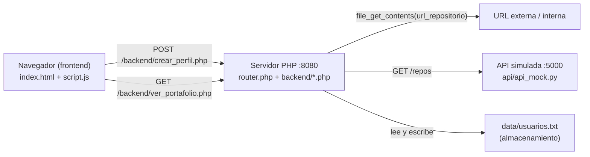

# Documentación Técnica — Portafolio Dev

Proyecto de Ciberseguridad, UCAB 2026. Ejercicio académico de **simulación de
ataque y remediación**: una aplicación web construida a propósito con dos
vulnerabilidades, que luego se corrige en una rama aparte. Este documento reúne
las justificaciones que pide la rúbrica, escritas en lenguaje claro y basadas en
el código real del repositorio.

> **Advertencia:** la aplicación es vulnerable por diseño. Debe desplegarse solo
> en un laboratorio aislado (VMs de VirtualBox en red host-only). Nunca exponer
> los puertos 8080 o 5000 a una red pública.

---

## 1. Descripción de la aplicación

"Portafolio Dev" es una web sencilla donde una persona desarrolladora crea un
perfil y muestra sus repositorios. Tiene dos acciones:

1. **Crear perfil**: un formulario envía nombre, apellido, biografía y la URL de
   un repositorio. El servidor descarga esa URL para mostrar una vista previa y
   guarda el perfil en un archivo de texto.
2. **Ver portafolio**: un botón carga el último perfil guardado y una lista de
   repositorios que provienen de una API externa (simulada), y los pinta en la
   página.

Estas dos acciones son, justamente, las que contienen las vulnerabilidades: la
descarga de la URL (SSRF) y el consumo de la API externa sin validar (que
termina en XSS en el navegador).

---

## 2. Arquitectura y tecnologías

La aplicación tiene tres piezas que se comunican por HTTP:



| Capa | Tecnología | Detalle |
|---|---|---|
| Frontend | HTML + CSS + JavaScript vanilla | `frontend/index.html`, `frontend/script.js`, `frontend/styles.css`. Usa `fetch` e `innerHTML`. |
| Backend | PHP (servidor embebido `php -S`) | Puerto **8080**, enrutado por `router.php`. Endpoints en `backend/`. |
| API externa (simulada) | Python (`http.server`) | Puerto **5000**, `api/api_mock.py`. Representa un servicio de terceros. |
| Almacenamiento | Archivo de texto plano | `data/usuarios.txt`, un registro JSON por línea. |

**El router (`router.php`)** sirve `index.html` en la raíz, entrega archivos
estáticos del directorio `frontend/` según su extensión, y para rutas que
empiezan por `/backend/` incluye el script PHP correspondiente. (Ver la nota de
seguridad sobre path traversal añadida como comentario en ese archivo.)

---

## 3. Laboratorio de pruebas

El ejercicio se ejecuta sobre dos máquinas virtuales en **VirtualBox**,
conectadas por una red **host-only / interna** (por ejemplo `192.168.56.0/24`),
para que el tráfico de ataque quede totalmente aislado.

| VM | Rol | IP de ejemplo | Software |
|---|---|---|---|
| Ubuntu Server 22.04 | Víctima | 192.168.56.100 | App PHP (:8080) + API mock (:5000) |
| Kali Linux | Atacante | 192.168.56.101 | Navegador, `curl`, herramientas de pentesting |

Arranque de servicios en la víctima (dos terminales):

```bash
# Terminal 1 — API externa simulada
python3 api/api_mock.py 5000

# Terminal 2 — aplicación PHP
php -S 0.0.0.0:8080 router.php
```

| Servicio | Puerto | Expuesto a |
|---|---|---|
| App PHP | 8080 | Kali (red de laboratorio) |
| API mock | 5000 | App PHP y, en la demo de ataque, también Kali |

> Guía detallada de despliegue: [despliegue_vms.md](despliegue_vms.md).

---

## 4. Superficie de ataque e inventario de endpoints

| Endpoint | Método | Servicio | Función | Riesgo |
|---|---|---|---|---|
| `/backend/crear_perfil.php` | POST | PHP :8080 | Recibe el formulario y descarga `url_repositorio` | **SSRF (API7:2023 / CWE-918)** |
| `/backend/ver_portafolio.php` | GET | PHP :8080 | Lee el perfil y consume `/repos` de la API | **Consumo No Seguro de APIs (API10:2023) → XSS (CWE-79)** |
| `/repos` | GET | API :5000 | Devuelve la lista de repositorios | Fuente de datos en la que confía el backend |
| `/update_repos` | POST | API :5000 | Reemplaza la lista de repositorios **sin autenticación ni validación** | Punto por el que el atacante "compromete" la API |

El endpoint `/update_repos` es la palanca del segundo ataque: no pide
autenticación ni valida la estructura del cuerpo (`api/api_mock.py`), así que
cualquiera en la red puede reemplazar los repositorios por contenido malicioso.

---

## 5. Detalle de las vulnerabilidades

### 5.1 SSRF en `backend/crear_perfil.php`

**Qué es (versión vulnerable).** El servidor toma el campo `url_repositorio` del
POST y ejecuta `file_get_contents($_POST['url_repositorio'])` sin comprobar el
esquema, el dominio ni la IP de destino. Como la petición sale *desde el
servidor víctima*, el atacante lo usa como proxy para alcanzar sitios que él no
podría ver directamente.

**Por qué es vulnerable (OWASP).** Corresponde a **API7:2023 – Server Side
Request Forgery** y **CWE-918**. El servidor confía en una URL controlada por el
usuario y realiza una petición en su nombre. Consecuencias demostrables en el
laboratorio:

- Acceder a servicios internos: `http://127.0.0.1:5000/repos`, `http://127.0.0.1:22`.
- Escanear puertos internos comparando el `estado_conexion` de la respuesta.
- Leer archivos locales con `file:///etc/passwd` (esquema `file://`).
- Intentar leer metadatos de instancia en entornos cloud.

Además, la versión vulnerable **devolvía el contenido descargado** al cliente
(`preview_repositorio`) sin escapar, lo que amplifica la fuga de información.

### 5.2 Consumo No Seguro de APIs → XSS en `backend/ver_portafolio.php` + `frontend/script.js`

**Qué es (versión vulnerable).** `ver_portafolio.php` pide la lista de
repositorios a la API mock (`GET /repos`) y **reenvía ese JSON al frontend tal
cual**, sin validar su forma ni escapar sus campos. El frontend
(`script.js`) lo inserta con `innerHTML`. Si la API fue manipulada (vía
`/update_repos`) para incluir `<script>` o un atributo de evento en el campo
`descripcion`, ese código se ejecuta en el navegador de la víctima.

**Por qué es vulnerable (OWASP).** El origen es **API10:2023 – Unsafe
Consumption of APIs** combinado con **CWE-20 (validación de entrada
insuficiente)**: el backend trata a un tercero como si fuera de confianza. La
consecuencia es **CWE-79 – Cross-Site Scripting**, que en el catálogo de
aplicaciones web se relaciona con **OWASP A03:2021 (Inyección)** y, por tratarse
de una decisión de diseño insegura, con **A05:2021 (Security Misconfiguration)**.
Es una **cadena de confianza rota**: API mock → backend → frontend, donde ningún
eslabón sanea el dato.

---

## 6. Contramedidas de la rama asegurada

Las correcciones están en la rama `versión-asegurada` (comentarios `CORREGIDO:`
en el código). Resumen de lo implementado:

### 6.1 Contra el SSRF (`crear_perfil.php`)

| Medida | Cómo funciona en el código |
|---|---|
| **Allowlist de dominios** | `DOMINIOS_REPOSITORIO_PERMITIDOS` (github/gitlab/bitbucket) y `ENDPOINTS_INTERNOS_PERMITIDOS` (solo la API mock). |
| **Solo http/https** | `url_repositorio_es_segura()` rechaza `file://`, `gopher://`, `dict://`, etc. |
| **Bloqueo de IPs internas** | `gethostbyname()` + `filter_var()` con `FILTER_FLAG_NO_PRIV_RANGE` y `FILTER_FLAG_NO_RES_RANGE`: descarta loopback, rangos privados y reservados. |
| **Sin seguir redirecciones** | `follow_location => 0` evita que un dominio permitido redirija a una IP interna (bypass de allowlist). |
| **Escapar la vista previa** | `htmlspecialchars(..., ENT_QUOTES)` sobre el contenido externo, limitado a 500 caracteres. |
| **Escritura segura** | `file_put_contents()` con `FILE_APPEND` y `LOCK_EX` para evitar condiciones de carrera. |

### 6.2 Contra el Consumo Inseguro / XSS (`ver_portafolio.php`)

| Medida | Cómo funciona en el código |
|---|---|
| **Validar el perfil leído** | `perfil_es_valido()` exige los campos y tipos esperados antes de usar el registro. |
| **Validar cada repositorio** | `repo_es_valido()` comprueba campos, tipos y que `url` sea una URL `http/https` válida; los inválidos se descartan con `array_filter`. |
| **Escape recursivo** | `escapar_valores_recursivo()` aplica `htmlspecialchars()` con `ENT_QUOTES` y `ENT_SUBSTITUTE` a todos los strings antes de enviarlos al frontend. |
| **CORS restringido** | El `Access-Control-Allow-Origin` solo responde a orígenes de la allowlist, en vez de `*`. |

### 6.3 Nota sobre el frontend (`script.js`)

`script.js` **no cambió** entre ramas: sigue usando `innerHTML`. Aun así, en la
rama asegurada es seguro porque **los datos llegan ya escapados desde el
servidor**: un payload como `<script>` viaja convertido en `&lt;script&gt;` y el
navegador lo muestra como texto inerte. Los comentarios de ese archivo se
actualizaron para reflejarlo y se deja como **recomendación opcional de defensa
en profundidad** migrar a `textContent` / `createElement`, de modo que el
frontend sea seguro por sí mismo aunque el contrato del backend cambie.

---

## 7. Mapeo CWE / OWASP / MITRE ATT&CK

| Vulnerabilidad | OWASP | CWE | Archivo | MITRE ATT&CK |
|---|---|---|---|---|
| Server Side Request Forgery | **API7:2023** | **CWE-918** | `backend/crear_perfil.php` | **T1190** (Explotar app pública), **T1046** (Descubrimiento de servicios de red) |
| Consumo No Seguro de APIs | **API10:2023** | **CWE-20** | `backend/ver_portafolio.php` | **T1195.002** (Compromiso de cadena de suministro de software, vía `/update_repos`) |
| Cross-Site Scripting (consecuencia) | **A03:2021 / A05:2021** | **CWE-79** | `frontend/script.js` | **T1059.007** (Ejecución de JavaScript en el navegador) |
| Path Traversal (observación, mitigable) | — | **CWE-22** | `router.php` | — |

---

## 8. Pasos del ataque (MITRE ATT&CK)

### 8.1 Cadena SSRF

1. **T1190 — Explotar aplicación pública.** El atacante envía un POST a
   `/backend/crear_perfil.php` con `url_repositorio` apuntando a un destino
   interno en lugar de un repositorio real.
2. **T1046 — Descubrimiento de servicios de red.** Variando la URL
   (`127.0.0.1:5000`, `127.0.0.1:22`, `127.0.0.1:9999`) y comparando el
   `estado_conexion` y el `preview_repositorio` de la respuesta, mapea qué
   puertos internos están abiertos.
3. **Exfiltración local.** Con `file:///etc/passwd` intenta leer archivos del
   sistema, cuyo contenido regresaba en `preview_repositorio` en la versión
   vulnerable.

### 8.2 Cadena Consumo Inseguro → XSS

1. **T1195.002 — Compromiso de la cadena de suministro.** El atacante hace un
   POST a `http://VICTIMA:5000/update_repos` (sin autenticación) e inyecta un
   repositorio cuya `descripcion` contiene `<script>...</script>` o un atributo
   de evento.
2. **Propagación por confianza ciega.** `ver_portafolio.php` pide `/repos`,
   recibe el payload y lo reenvía al frontend sin sanear (API10:2023).
3. **T1059.007 — Ejecución de JavaScript.** La víctima pulsa "Cargar
   Portafolio"; `script.js` inserta la descripción con `innerHTML` y el código
   se ejecuta (robo de cookies, redirección, etc.).

> Guiones detallados: [demo_ssrf.md](demo_ssrf.md) y [demo_xss_api.md](demo_xss_api.md).
> Catálogo de payloads: [payloads.txt](payloads.txt).

---

## 9. Organización del equipo

| Equipo | Rol | Integrantes |
|---|---|---|
| **Red Team** | Ataque / explotación | Levin Jiménez, Jesús Sayago |
| **Blue Team** | Desarrollo y defensa | Claudia López, Óscar Manrique, Juan Zamora |

- **Red Team** construyó y documentó los vectores de ataque (SSRF y XSS vía API
  comprometida) sobre la rama `versión-vulnerable`.
- **Blue Team** implementó las contramedidas en la rama `versión-asegurada` y
  mantiene la documentación de justificación.

---

## 10. Validación de cierre

Criterios para dar por cerrado el ejercicio de remediación:

- [x] Cada vulnerabilidad está identificada con su archivo, OWASP, CWE y técnica MITRE.
- [x] Existe una rama `versión-asegurada` con las mitigaciones implementadas y comentadas (`CORREGIDO:`).
- [x] SSRF mitigado: allowlist + solo http/https + bloqueo de IPs privadas/reservadas + sin redirecciones + escape de la vista previa.
- [x] Consumo inseguro mitigado: validación de estructura (`perfil_es_valido`, `repo_es_valido`) + escape recursivo antes de enviar al frontend.
- [x] Comentarios del frontend corregidos: se aclara que la mitigación del XSS es del lado del servidor (los datos llegan escapados) y se anota la recomendación opcional de `textContent`.
- [x] Documentación técnica con justificaciones OWASP/CWE/MITRE (este archivo).

**Comprobación funcional recomendada** (en la rama asegurada, laboratorio
aislado):

1. Enviar `url_repositorio = http://127.0.0.1:22` → el servidor responde con
   error de validación (allowlist), no realiza la petición interna.
2. Comprometer la API con un `<script>` en `descripcion` y cargar el portafolio
   → el texto aparece **escrito literalmente**, sin ejecutarse.
3. Confirmar que la lógica y el comportamiento de la aplicación no cambiaron por
   esta entrega: los ajustes se limitan a comentarios y a este documento.
