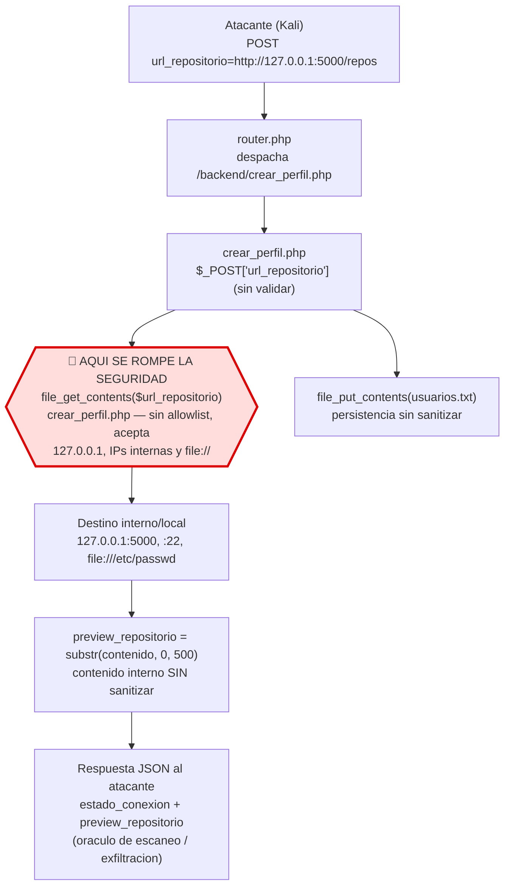
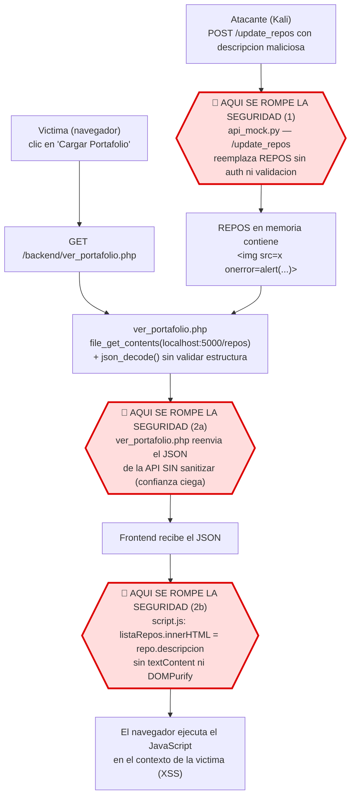

# Flujo de Datos de las Vulnerabilidades

Proyecto de Ciberseguridad UCAB 2026 — rama `versión-vulnerable`.

Diagramas de flujo de datos (Mermaid) para las **dos vulnerabilidades
obligatorias**. Cada diagrama marca con **🔴 AQUI SE ROMPE LA SEGURIDAD** el punto
exacto del codigo donde falla la validacion o el escape.

Para el guion de explotacion ver [demo_ssrf.md](demo_ssrf.md) y
[demo_xss_api.md](demo_xss_api.md); para el mapeo de endpoints,
[INVENTARIO_ENDPOINTS.md](INVENTARIO_ENDPOINTS.md).

---

## 1. SSRF — `backend/crear_perfil.php` (API7:2023 / CWE-918)

El dato del atacante (`url_repositorio`) viaja desde el formulario hasta
`file_get_contents()` **sin ninguna validacion de destino ni de esquema**. Ese es
el punto de ruptura.

**Punto de ruptura (una sola causa raiz):** la variable `$url_repositorio`
proviene directamente de `$_POST` y se pasa integra a `file_get_contents()`. No hay
allowlist de dominios, no se bloquean rangos internos (RFC1918 / localhost /
link-local) ni se restringen esquemas (`file://`). Ademas, el contenido obtenido se
**devuelve** al cliente en `preview_repositorio`, lo que convierte al servidor en un
**oraculo** para escanear la red interna y exfiltrar archivos.

---

## 2. Consumo No Seguro de APIs → XSS (API10:2023 / CWE-20 → CWE-79)

Aqui hay **dos puntos de ruptura encadenados**: (a) la API acepta contenido
malicioso sin autenticacion/validacion, y (b) ese contenido llega hasta el
navegador porque ni el backend lo sanitiza ni el frontend lo escapa.

**Puntos de ruptura encadenados:**

1. **`api/api_mock.py` (`/update_repos`)** — acepta cualquier JSON y reemplaza la
   lista `REPOS` **sin autenticacion ni validacion de estructura**. Es donde entra
   el payload (CWE-20 / API10:2023).
2. **`backend/ver_portafolio.php`** — consulta la API y **reenvia el JSON tal cual**
   (`json_decode()` sin validar, `json_encode($payload)`): confianza ciega en un
   tercero (CWE-20 / API10:2023).
3. **`frontend/script.js`** — asigna `repo.descripcion` a `innerHTML` sin escapar,
   por lo que el navegador **ejecuta** el HTML/JS inyectado (CWE-79).

Ninguna capa por si sola completa el ataque; la cadena rota de confianza (API →
backend → frontend) es lo que lo hace explotable. Ver la "cadena de confianza rota"
detallada en [demo_xss_api.md](demo_xss_api.md) y el impacto en
[ANALISIS_IMPACTO.md](ANALISIS_IMPACTO.md).
