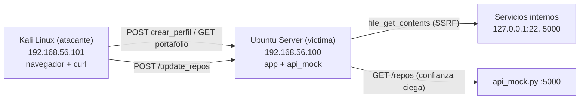

# Guia de Despliegue en VMs - Proyecto Ciberseguridad 2026

> **ADVERTENCIA:** Esta aplicacion es intencionalmente vulnerable. Desplegarla
> solo en una red aislada (host-only o red interna de laboratorio). Nunca
> exponer los puertos 8080 o 5000 a redes publicas o de produccion.

## 1. Arquitectura de Red



| VM | Rol | IP de ejemplo | Servicios |
|---|---|---|---|
| Ubuntu Server 22.04 | Victima (aplicacion) | 192.168.56.100 | PHP app (:8080), API mock (:5000) |
| Kali Linux | Atacante | 192.168.56.101 | Navegador, curl, herramientas de pentesting |

### Configuracion de red en VirtualBox/VMware

1. Crear una red **Host-Only** o **Internal Network** (ej. `vboxnet0`).
2. Asignar ambas VMs a esa red.
3. Configurar IPs estaticas o via DHCP reservado dentro del rango (ej. `192.168.56.0/24`).
4. Verificar conectividad: desde Kali, ejecutar `ping 192.168.56.100`.

## 2. Requisitos en Ubuntu Server (Victima)

```bash
# Actualizar paquetes
sudo apt update && sudo apt upgrade -y

# Instalar dependencias
sudo apt install -y python3 php-cli git

# Verificar versiones
python3 --version   # >= 3.8
php --version       # >= 8.0
```

## 3. Clonar y Preparar el Proyecto

```bash
# Clonar el repositorio (rama vulnerable)
git clone -b versión-vulnerable https://github.com/USUARIO/Proyecto-Ciberseguridad-2026.git
cd Proyecto-Ciberseguridad-2026

# Crear directorio de datos si no existe
mkdir -p data
touch data/usuarios.txt
chmod 666 data/usuarios.txt
```

## 4. Arrancar los Servicios

Se necesitan **dos terminales** en la VM Ubuntu Server.

### Terminal 1: API Mock (puerto 5000)

```bash
cd /ruta/al/proyecto
python3 api/api_mock.py 5000
```

Salida esperada:
```
API Mock corriendo en http://0.0.0.0:5000
```

### Terminal 2: Aplicacion PHP (puerto 8080)

```bash
cd /ruta/al/proyecto
php -S 0.0.0.0:8080 router.php
```

Salida esperada:
```
PHP 8.x Development Server (http://0.0.0.0:8080) started
```

### Puertos utilizados

| Servicio | Puerto | Archivo |
|---|---|---|
| API Mock (Python) | 5000 | `api/api_mock.py` |
| App PHP (frontend + backend) | 8080 | `router.php` |

> **Nota:** El backend (`backend/ver_portafolio.php`) apunta a
> `http://localhost:5000/repos`. Ambos servicios deben correr en la misma
> maquina (Ubuntu Server).

## 5. Verificacion desde Kali (Atacante)

Ejecutar estos comandos desde la VM Kali para confirmar que todo funciona:

```bash
VICTIMA=192.168.56.100

# 5.1 API Mock responde
curl -s http://$VICTIMA:5000/repos | python3 -m json.tool
# Esperado: JSON con 2 repositorios de ejemplo

# 5.2 Frontend accesible
curl -s -o /dev/null -w "%{http_code}" http://$VICTIMA:8080/
# Esperado: 200

# 5.3 Backend de portafolio responde
curl -s http://$VICTIMA:8080/backend/ver_portafolio.php | python3 -m json.tool
# Esperado: JSON con perfil (null si no hay perfiles) y repos

# 5.4 Crear perfil de prueba
curl -s -X POST http://$VICTIMA:8080/backend/crear_perfil.php \
  -F "nombre=Test" \
  -F "url_repositorio=https://github.com/test/repo" | python3 -m json.tool
# Esperado: status=perfil_creado
```

## 6. Checklist de Estado Sano (Pre-Demo)

Marcar cada item antes de iniciar la demostracion:

- [ ] Ambas VMs encendidas y en la misma red host-only
- [ ] `ping 192.168.56.100` responde desde Kali
- [ ] `python3 api/api_mock.py 5000` corriendo en Ubuntu (Terminal 1)
- [ ] `php -S 0.0.0.0:8080 router.php` corriendo en Ubuntu (Terminal 2)
- [ ] `curl http://192.168.56.100:5000/repos` devuelve JSON con 2 repos
- [ ] `curl http://192.168.56.100:8080/` devuelve HTML del frontend
- [ ] `curl http://192.168.56.100:8080/backend/ver_portafolio.php` devuelve JSON con repos
- [ ] Navegador en Kali abre `http://192.168.56.100:8080/` correctamente
- [ ] Archivo `data/usuarios.txt` vacio o con datos de prueba limpios

## 7. Resetear el Entorno (Post-Demo)

Para volver al estado inicial entre demostraciones:

```bash
# En Ubuntu Server:

# 7.1 Vaciar perfiles guardados
> data/usuarios.txt

# 7.2 Reiniciar la API mock (Ctrl+C en Terminal 1, luego volver a arrancar)
# Esto restaura los repositorios originales (elimina payloads XSS inyectados)
python3 api/api_mock.py 5000

# 7.3 Verificar estado limpio
curl -s http://localhost:5000/repos | python3 -m json.tool
curl -s http://localhost:8080/backend/ver_portafolio.php | python3 -m json.tool
```

## 8. Solucion de Problemas

| Problema | Causa probable | Solucion |
|---|---|---|
| `Connection refused` en puerto 8080 | PHP server no arrancado | Ejecutar `php -S 0.0.0.0:8080 router.php` |
| `Connection refused` en puerto 5000 | API mock no arrancada | Ejecutar `python3 api/api_mock.py 5000` |
| Portafolio devuelve error 502 | API mock caida o puerto incorrecto | Verificar que mock corre en 5000 y `ver_portafolio.php` apunta a `:5000` |
| No hay conectividad entre VMs | Red mal configurada | Verificar adaptador host-only en VirtualBox/VMware |
| `Permission denied` en usuarios.txt | Permisos del archivo | `chmod 666 data/usuarios.txt` |
